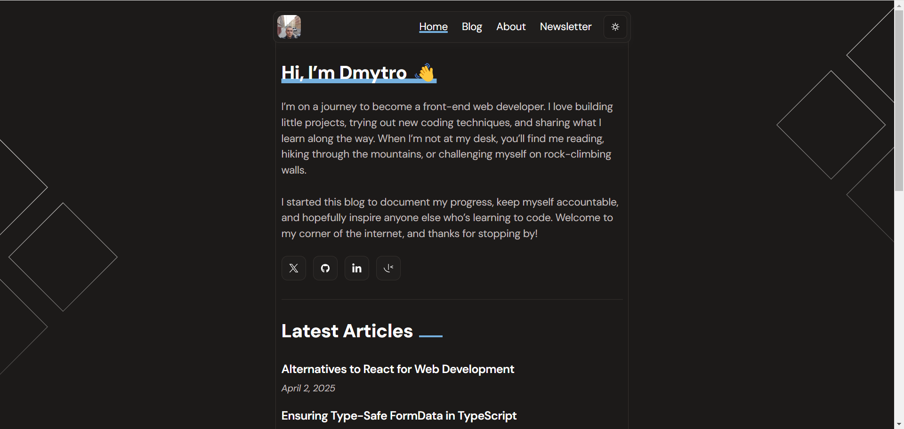

# Frontend Mentor - Personal blog solution

This is a solution to the [Personal blog challenge on Frontend Mentor](https://www.frontendmentor.io/challenges/personal-blog-lJpVCnmozL). Frontend Mentor challenges help you improve your coding skills by building realistic projects. 

## Table of contents

- [Overview](#overview)
  - [The challenge](#the-challenge)
  - [Screenshot](#screenshot)
  - [Links](#links)
- [My process](#my-process)
  - [Built with](#built-with)
  - [What I learned](#what-i-learned)
  - [Continued development](#continued-development)
  - [Useful resources](#useful-resources)
- [Author](#author)
- [Acknowledgments](#acknowledgments)

## Overview

### The challenge

Users should be able to:

- Navigate to all pages by clicking links or using their keyboard
- Read all articles
- Select their color theme
- Submit their email to subscribe to the newsletter
- Receive an error message when the newsletter form is submitted if:
  - The Email Address field is empty
  - The Email Address is not formatted correctly
- Receive a success message if submitted correctly
- View the optimal layout for the interface depending on their device's screen size
- See hover and focus states for all interactive elements on the page

### Screenshot



### Links

- Solution URL: [GitHub](https://github.com/DmytroVoitovych/Personal-Voitovych-blog)
- Live Site URL: [LivePage](https://personal-voitovych-blog.vercel.app/)

## My process

### Built with

- Semantic HTML5 markup
- CSS custom properties
- Flexbox
- CSS Grid
- Mobile-first workflow
- [React](https://reactjs.org/) - JS library
- [Next.js](https://nextjs.org/) - React framework
- [CSS Modules](https://github.com/css-modules/css-modules) - For styles
- [Supabase DataBase](https://supabase.com/docs/guides/getting-started/quickstarts/nextjs) - For store data
- [MDX Parser](https://github.com/hashicorp/next-mdx-remote#readme) - For parse content
- [BPROGRESS](https://bprogress.vercel.app/) - For style page transition
- [NODEMAILER](https://www.nodemailer.com/) - For sending a message

### What I learned

Just wanted to share something important from my recent coding experience! I ran into some serious problems while building my Next.js app. Even though I set up Turbopack exactly as the docs said, things broke during the build process. After hours of debugging and breaking my project into tiny pieces, I finally discovered the culprit - an SVG plugin that doesn't play nice with Turbopack. The fix was actually pretty simple once I knew what was wrong - just needed some extra webpack config. The big lesson here? Be really careful with those experimental features in Next.js - they can cause you major headaches!

To see how you can acctualy set config for svg, see below:


```js
 webpack(config) {
    config.module.rules.push({
      test: /\.svg$/,
      use: [
        {
          loader: "@svgr/webpack",
          options: {
            icon: true,
          },
        },
      ],
    });
    return config;
  }
```

### Continued development
Since Next.js took up so much of my time, I'm planning to build my next project with vanilla JavaScript and perhaps some browser APIs. I'm still considering my options.
### Useful resources

- [Next cache and ORM Supabase](https://tylermarshall.medium.com/enhancing-data-caching-in-nextjs-14-with-supabase-webhooks-124524e4acdd) - This helped me to add next fetch in supabase server client, good article.
- [MDX option issue](https://github.com/hashicorp/next-mdx-remote/issues/485) - This is an amazing article which helped me finally parse out blog content.


## Author

- Website - [Dmytro Voitovych](https://portfolio-dmytrovoitovych.vercel.app/)
- Frontend Mentor - [@dmytrovoitovych](https://www.frontendmentor.io/profile/DmytroVoitovych)


